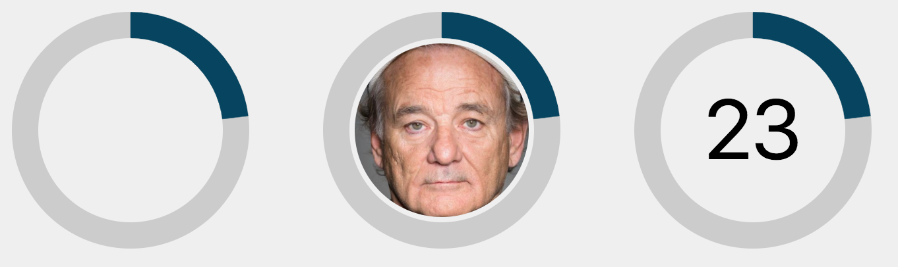

# SVG-progress-circle

An addon for ember-cli that adds a component to show a sizable circle made with a SVG.
This component is part of the rewrite of the frontend-app for my job at easyPEP.

* easyPEP (german name): [homepage](https://easypep.de/de/)
* Staffomatic (english name): [homepage](https://staffomatic.com/en/)
* [easyPEP github](https://github.com/easyPEP)

## Screenshot


## Installation

* `ember install svg-progress-circle`

## Todo:
* Make it "real" responsive
* Perfectly center text inside
* Add animations
* Add a demo

## Usage

```handlebars
{{#svg-progress-circle size="40" strokeWidth="3" percentage=model.somePercentage}}
  <text x="20" y="-16" font-size="12" transform="rotate(90)" text-anchor="middle">
    {{schedule.coveragePercentage}}
  </text>
{{/svg-progress-circle}}

// or blockless:

{{svg-progress-circle size="40" strokeWidth="3" percentage=model.somePercentage}}
```

### Options

* `size` default `90` -> the SVG viewport
* `strokeWidth` default `10` -> the width of the border
* `percentage` default `0` -> a value between `1` and `100`


### CSS

The addon provides the following classes to style the file-picker:

* `.progress-circle`
  * `.progress-circle__svg`
    * `.progress-circle__circle`
    * `.progress-circle__indicator(--empty|filled)`

## Running

* `ember server`
* Visit your app at http://localhost:4200.

## Running Tests

* `ember test`
* `ember test --server`

## Building

* `ember build`

For more information on using ember-cli, visit [http://www.ember-cli.com/](http://www.ember-cli.com/).

## Publishing

```bash
ember release
npm publish
```
